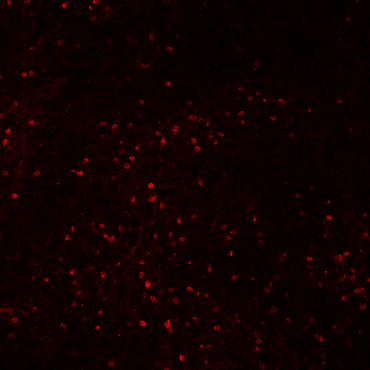

# Cell Detection

A Python project that detects the pixel locations of individual cells in microscope slides.

Input Slide                |  Detected Cells
:-------------------------:|:-------------------------:
|

## Setup
```bash
virtualenv env
. env/bin/activate
pip install -r requirements.txt
```

## Running
```bash
. env/bin/activate
python cell-detection/main.py -i 'data/raw/testSlide1.png'
```

### Arguments
- Input (```-i``` or ```--input-file```) the path to the input file or directory of files
- Output (```-o``` or ```--output-file```) the path of the output json file (default is results.json)

### Options
- Show process (```--show-process```) displays images to show the steps of filtering

## Output File Format (JSON)
```json
{
  "cells": [
    [
        {
            "x": 40,
            "y": 21
        },
        {
            "x": 40,
            "y": 22
        },
    ],
  ]
}
```
