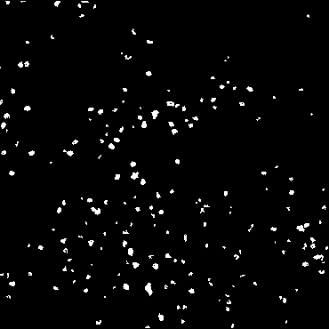

# Cell Detection

A Python project that detects the pixel locations of individual cells in a microscope slide. The script filters out background noise in the slide using multiple techniques and groups pixels into cells using a flood-fill algorithm.

Input Slide                |  Detected Cells
:-------------------------:|:-------------------------:
|

## Setup
```bash
virtualenv env
. env/bin/activate
pip install -r requirements.txt
```

## Running
```bash
. env/bin/activate
python cell-detection/main.py -i 'data/raw/testSlide1.png'
```

### Arguments
- Input (```-i``` or ```--input-file```) the path to the input file or directory of files
- Output (```-o``` or ```--output-file```) the path of the output json file (default is results.json)

### Options
- Show process (```--show-process```) displays images to show the steps of filtering

---

## Output File Format
The output file contains a JSON object with the array "cells" as the only key. Each element in the "cells" array is a "cell" object, which is an array of pixel locations that cell occupies, represented by the x and y pixel coordinates of each pixel. A basic example is as follows:
```json
{
  "cells": [
    [
        {
            "x": 40,
            "y": 21
        },
        {
            "x": 40,
            "y": 22
        },
    ],
  ]
}
```

## Slide Processing Algorithm
1. Convert to grayscale, normalize pixels to range of [0, 1]
2. Filter out noise by setting pixels in [0, 0.3] to 0, all others to 1
3. Remove any cells that are unreasonably small (likely noise)
4. Expand/merge existing cells to avoid splicing single cells into multiple
4. Count final cells with flood-fill search

Processing Stage  |  Slide
:----------------:|:-------------------------:
Input             |
Grayscale         |
Simple Noise Gate |
Cell Size Filter, Expand/Merge  |
